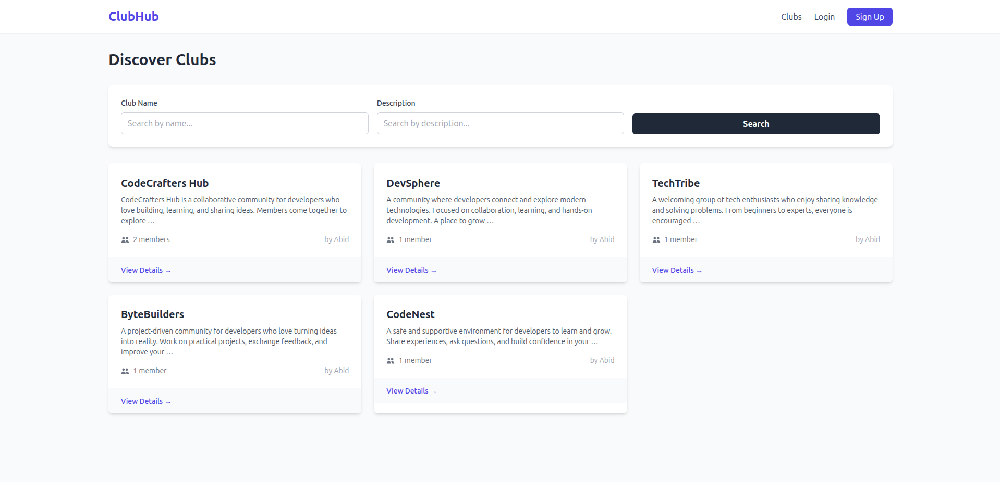
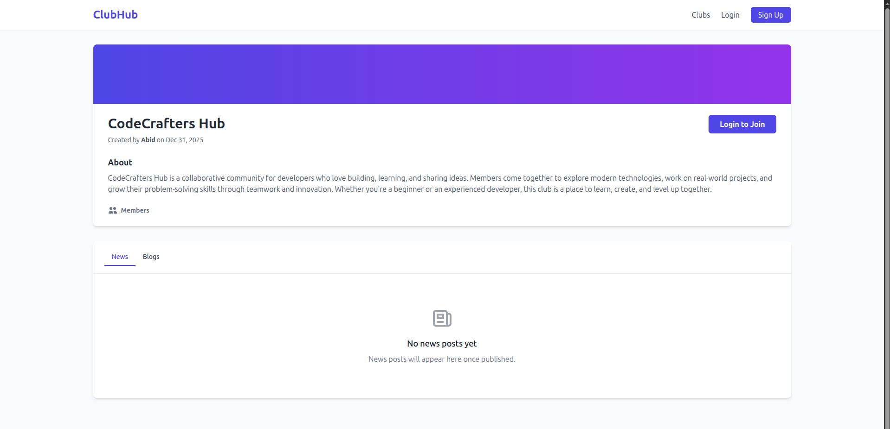
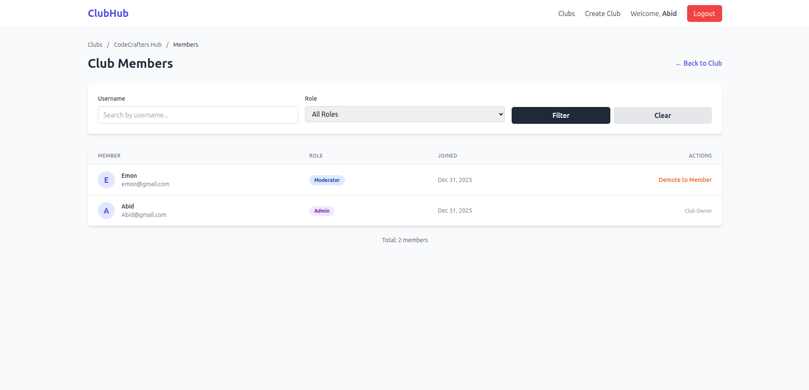
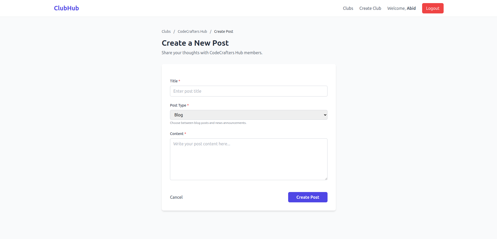

# ClubHub

A Django-based web application for creating and managing clubs with role-based permissions, membership workflows, and content publishing.

## Table of Contents

- [Overview](#overview)
- [Features](#features)
- [Screenshots](#screenshots)
- [Tech Stack](#tech-stack)
- [Installation](#installation)
- [Usage](#usage)
- [Project Structure](#project-structure)
- [Environment Variables](#environment-variables)
- [License](#license)

## Overview

ClubHub is a platform where users can create clubs, request membership, and publish content based on their assigned roles. The application implements a hierarchical permission system with three distinct roles: Admin, Moderator, and Member.

## Features

### Authentication
- User registration and login
- Secure session-based authentication
- Password validation and security

### Club Management
- Create and browse clubs
- Club detail pages with organized content tabs
- Search and filter clubs by name and description
- Pagination for club listings

### Membership System
- Request-based membership workflow
- Three-tier role system:
  - **Admin**: Full club management, approve/reject requests, create all post types, promote members
  - **Moderator**: Create blog and news posts
  - **Member**: Create blog posts only
- Member list with filtering by username and role
- Promote/demote member roles (Admin only)

### Content Publishing
- Two post types: Blog and News
- Role-based posting permissions
- Post listings separated by type with tabs
- Pagination for posts, members, and requests
- Search and filter functionality across all lists

### User Interface
- Responsive design with Tailwind CSS
- Intuitive navigation and breadcrumbs
- Real-time feedback with Django messages
- Mobile-friendly layouts

## Screenshots

### Club List


### Club Detail Page


### Member Management


### Post Creation


## Tech Stack

### Backend
- **Django 6.0** - Web framework
- **PostgreSQL** - Database
- **django-filter** - Advanced filtering for querysets

### Frontend
- **Tailwind CSS** - Styling framework
- **Vanilla JavaScript** - Client-side interactions

### DevOps
- **Docker** - Containerization
- **Docker Compose** - Multi-container orchestration

## Installation

### Prerequisites
- Docker and Docker Compose installed on your system
- Git (for cloning the repository)

### Quick Start with Docker

1. Clone the repository:
```bash
git clone https://github.com/Abid101e/ClubHub.git
cd ClubHub
```

2. Copy the environment file:
```bash
cp .env.example .env
```

3. Build and start the containers:
```bash
docker compose up --build
```

4. The application will be available at `http://localhost:8000`

5. Create a superuser (in a new terminal):
```bash
docker compose exec web python manage.py createsuperuser
```

6. Access the admin panel at `http://localhost:8000/admin/`

### Local Development Setup

If you prefer to run without Docker:

1. Create a virtual environment:
```bash
python -m venv venv
source venv/bin/activate  # On Windows: venv\Scripts\activate
```

2. Install dependencies:
```bash
pip install -r requirements.txt
```

3. Set up PostgreSQL database:
```bash
# Install PostgreSQL and create database
createdb club_db
createuser club_user
```

4. Configure environment variables in `.env`:
```
DB_NAME=club_db
DB_USER=club_user
DB_PASSWORD=your_password
DB_HOST=localhost
DB_PORT=5432
SECRET_KEY=your-secret-key
DEBUG=True
```

5. Run migrations:
```bash
python manage.py migrate
```

6. Create a superuser:
```bash
python manage.py createsuperuser
```

7. Run the development server:
```bash
python manage.py runserver
```

## Usage

### Creating a Club

1. Register for an account or log in
2. Navigate to the clubs page
3. Click "Create Club"
4. Fill in the club name and description
5. You automatically become the club admin

### Joining a Club

1. Log in to your account
2. Browse clubs and select one
3. Click "Join Club"
4. Wait for admin approval

### Creating Posts

1. Join a club and get approved
2. Navigate to the club page
3. Click "Create Post"
4. Select post type based on your role:
   - Members: Blog posts only
   - Moderators/Admins: Blog and News posts

### Managing Members (Admin Only)

1. Go to your club's page
2. Click "View Requests" to approve/reject membership requests
3. Click "View Members" to see all members
4. Promote members to Moderator or demote them back to Member

## Project Structure

```
clubhub/
├── accounts/           # User authentication app
├── clubs/              # Club management app
│   ├── filters.py     # Django-filter configurations
│   ├── forms.py       # Club forms
│   ├── mixins.py      # Permission mixins
│   ├── models.py      # Club model
│   └── views.py       # Club views
├── memberships/        # Membership management app
│   ├── filters.py     # Membership filters
│   ├── models.py      # Membership model with QuerySet
│   └── views.py       # Membership workflows
├── posts/              # Post management app
│   ├── forms.py       # Post forms
│   ├── models.py      # Post model with manager
│   └── views.py       # Post views
├── templates/          # HTML templates
│   ├── base.html      # Base template
│   ├── accounts/      # Auth templates
│   ├── clubs/         # Club templates
│   └── posts/         # Post templates
├── static/             # Static files (CSS, JS)
├── clubhub/           # Project settings
├── docker-compose.yml  # Docker Compose configuration
├── Dockerfile         # Docker configuration
├── entrypoint.sh      # Docker entrypoint script
├── requirements.txt   # Python dependencies
├── manage.py          # Django management script
└── README.md          # This file
```

## Environment Variables

Create a `.env` file in the root directory with the following variables:

```env
# Database
DB_NAME=club_db
DB_USER=club_user
DB_PASSWORD=your_secure_password
DB_HOST=db
DB_PORT=5432

# Django
SECRET_KEY=your-secret-key-here
DEBUG=False
ALLOWED_HOSTS=localhost,127.0.0.1

# Superuser (for Docker auto-creation)
DJANGO_SUPERUSER_USERNAME=admin
DJANGO_SUPERUSER_EMAIL=admin@example.com
DJANGO_SUPERUSER_PASSWORD=admin123
```

## Key Features Implementation

### Role-Based Permissions
Custom mixins enforce role-based access:
- `ClubMemberRequiredMixin` - Requires approved membership
- `ClubAdminRequiredMixin` - Requires admin role

### Custom Managers and QuerySets
Chainable query methods for cleaner code:
```python
Membership.objects.approved().for_club(club).for_user(user)
Post.objects.published().blog_posts()
```

### Django Filters Integration
Advanced filtering on all list views:
- Clubs: Filter by name and description
- Members: Filter by username and role
- Requests: Search by username

### Pagination
All list views include pagination:
- Club list: 12 per page
- Member list: 20 per page
- Membership requests: 20 per page
- Posts (News/Blog): 10 per page with separate pagination

## Development

### Running Tests
```bash
python manage.py test
```

### Creating Migrations
```bash
python manage.py makemigrations
python manage.py migrate
```

### Collecting Static Files
```bash
python manage.py collectstatic
```

### Docker Commands
```bash
# Stop containers
docker compose down

# View logs
docker compose logs -f

# Access PostgreSQL
docker compose exec db psql -U club_user -d club_db

# Run management commands
docker compose exec web python manage.py <command>
```

## License

This project is licensed under the MIT License.

---

**Built with Django and Tailwind CSS**
